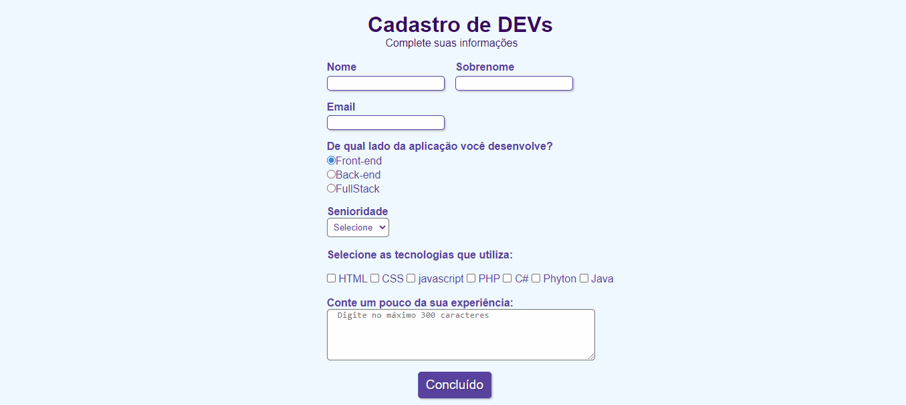

## Formulário 📋

Formulário estático de cadastro 

## Linguagens

    
    

 

## Preview

### Desafios no desenvolvimento do formulário

No decorrer do projeto tive dificuldades com posicionamentos em CSS, unidades de medidas e etc. 
Através deste projeto pude treinar e melhorar essas questões e adquirir muitos aprendizados!

Link do site: https://rayane-araujo.github.io/formulario/

